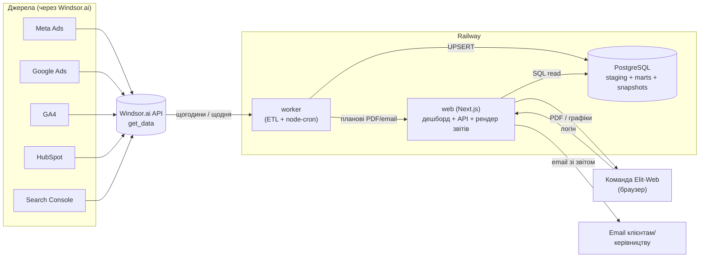

# Elit-Web Marketing Dashboard — технічний план та архітектура

**Версія:** 1.0 · **Дата:** 2026-08-12 · **Автор:** підготовлено для Serg (Elit-Web)
**Статус:** архітектурний план (код пишемо на наступному етапі)

---

## 1. Коротко (TL;DR) — що рекомендую

| Рішення | Рекомендація | Чому |
|---|---|---|
| **Стек** | Next.js 15 (TypeScript, App Router) + Postgres + окремий worker-сервіс на Node/TS | Один репозиторій, один мова, найлегший деплой на Railway, гарний UI «з коробки» через Tremor/Recharts, вбудований рендер PDF |
| **База даних** | PostgreSQL (Railway-плагін) | Історичні snapshot-и «як статистика», SQL-агрегації для звітів, безкоштовно в межах Railway |
| **Потік даних** | Власний ETL-worker тягне Windsor **get_data API** за розкладом → пише в Postgres | Повний контроль над каденцією, схемою та історією; не залежимо від обмежень Windsor destinations на Trial-плані |
| **Звіти** | Онлайн-дешборд + PDF (рендер через Playwright) + email-розсилка (Resend) | Покриває всі 3 обрані формати одним движком рендерингу |
| **Деплой** | Railway: 3 сервіси — `web`, `worker`, `Postgres` + GitHub CI/CD | Автодеплой з `main`, вбудований cron, керовані змінні оточення |

> **Головне застереження одразу:** оновлення «раз на 10 хв» реалістичне на рівні **дешборду** (наш UI перечитує нашу БД), але **самі рекламні/аналітичні джерела не оновлюються кожні 10 хв**. Деталі — розділ 3. Через це архітектура розділяє «частоту оновлення UI» і «частоту завантаження нових даних із Windsor».

---

## 2. Що реально є в акаунті Windsor.ai (перевірено)

Стан акаунту `elit.web.ima@gmail.com` на момент планування:

**План:** `TRIAL` (безкоштовний, не оплачений) — це впливає на ліміти історії/частоти, їх треба підтвердити перед продакшеном (розділ 14).

**Підключені канали (конектори):**

| Канал | Windsor slug | Акаунт | Обсяг полів |
|---|---|---|---|
| Meta Ads (Facebook/Instagram) | `facebook` | `837664791809030` — «Elit-web Укр V» | сотні |
| Google Ads | `google_ads` | `430-346-2372` — «Elit Web Оплата - счет» | ~2599 полів |
| Google Analytics 4 | `googleanalytics4` | `280095058` — «Elit-Web.ua - GA4» | 544 поля |
| HubSpot (CRM) | `hubspot` | `143596207` — «elit-web.com» | сотні |
| Google Search Console | `searchconsole` | `https://elit-web.ua/` | десятки |

**Destinations, які підтримує Windsor:** Google Sheets, Airtable, BigQuery, Snowflake, MySQL, **PostgreSQL**, **Supabase**, Azure SQL, Redshift, Databricks, S3, Azure Blob, Windsor Cloud DB.
Важливо: у всіх `create_in_chat = false` і немає збережених креденшелів — тобто автоекспорт налаштовується вручну через форму дашборду Windsor, і на Trial-плані розклад експорту, найімовірніше, обмежений (частина функцій — платні).

**Формат полів у get_data:** ID у snake_case, які треба брати з `get_fields` (не вигадувати). Приклади реальних ID:
- GA4: `date`, `sessions`, `total_users`, `new_users`, `active_users`, `engaged_sessions`, `engagement_rate`, `bounce_rate`, `conversions` (Key events), `purchase_revenue`, `source`, `medium`, `default_channel_group`, `campaign_name`
- Google Ads: `date`, `campaign`, `clicks`, `impressions`, `spend`, `conversions`, `conversions_value`, `ctr`, `average_cpc`, `cost_per_conversion`
- Meta/Search Console/HubSpot — аналогічно, ID підтверджуємо через `get_fields` на етапі реалізації.

---

## 3. Реальність «оновлення раз на 10 хвилин» — важливо прочитати

Дані в маркетингових джерелах **не змінюються кожні 10 хвилин**:

| Джерело | Реальна свіжість даних |
|---|---|
| GA4 (стандартні звіти) | обробка кілька годин; поточний день «дозріває» протягом доби |
| Google Search Console | затримка **2–3 дні**, оновлення раз на добу |
| Google Ads | статистика йде протягом дня, але фінальні цифри (конверсії) коригуються 1–3 дні |
| Meta Ads | оновлення протягом дня; атрибуція коригується до 28 днів |
| HubSpot | майже реальний час для CRM-об'єктів, але аналітика агрегується |
| Windsor sync | залежить від плану; на нижчих планах часто **раз на добу** |

**Висновок і як це вирішуємо архітектурно:**

1. **Дешборд-рівень (UI):** сторінка перечитує **нашу** БД кожні 5–10 хв (дешево, миттєво). Користувач бачить «живі» цифри — це і є відчуття «оновлення раз на 10 хв».
2. **Ingestion-рівень (ETL):** реальне завантаження з Windsor робимо за розумною каденцією:
   - **щогодини** — «гарячі» дані за сьогодні/вчора (today + yesterday) по Meta, Google Ads, GA4, HubSpot;
   - **раз на добу (ніч)** — повний перерахунок останніх 3–7 днів (щоб підхопити коригування атрибуції) + Search Console;
   - опційно **кожні 10–15 хв** — тільки якщо план Windsor реально віддає свіжі дані частіше (перевіримо емпірично).

Це чесно, економить квоту Windsor API і не створює ілюзії неіснуючої точності. За бажанням залишу конфіг `INGEST_INTERVAL`, щоб змінювати каденцію без переписування коду.

---

## 4. Рекомендований стек (з обґрунтуванням)

**Frontend + API:** **Next.js 15 (App Router, TypeScript)**
- Server Components + Route Handlers = і UI, і бекенд-API в одному застосунку.
- UI-бібліотека: **Tremor** (готові KPI-картки, графіки, таблиці під дешборди) поверх **Recharts**; стилі — Tailwind CSS.
- Чому не «чистий React + окремий бекенд»: більше рухомих частин, два деплої, більше коду. Next.js закриває 90% потреб одним сервісом.

**Worker (ETL + планувальник звітів):** окремий **Node/TS-процес**
- `node-cron` для розкладу; той самий код-бейз і типи, що й веб (спільні моделі даних через `packages/shared`).
- Чому окремий сервіс, а не cron всередині Next.js: ETL не має залежати від веб-трафіку/холодних стартів; окремий сервіс на Railway = стабільний фоновий воркер.

**База:** **PostgreSQL** (Railway) + **Drizzle ORM** (легкий, типобезпечний, зручні міграції).

**PDF:** **Playwright** — рендеримо приховану сторінку звіту в браузері й друкуємо в PDF. Один движок і для екрана, і для друку → звіти виглядають 1-в-1 як дешборд.

**Email:** **Resend** (простий API, дешево) або SMTP через Nodemailer — надсилання звітів за розкладом.

**Альтернатива, якщо захочете менше коду:** Windsor → Postgres (destination) + **Metabase/Grafana** зверху. Мінус — слабша кастомізація брендованих PDF-звітів і UX під агенцію. Тому рекомендую власний Next.js, але це рішення оборотне (Postgres спільний).

> Структура — монорепозиторій:
> ```
> elit-web-dashboard/
> ├── apps/web        # Next.js (дешборд + API + рендер звітів)
> ├── apps/worker     # ETL + планувальник PDF/email
> ├── packages/db     # Drizzle-схема, міграції, клієнт
> ├── packages/shared # типи, конектор-конфіги, утиліти
> ├── railway.json / railway.toml
> └── .github/workflows/ci.yml
> ```

---

## 5. Потік даних: як забирати з Windsor (рекомендація)

**Рекомендую варіант «власний cron тягне Windsor API»** (а не Windsor destinations), тому що:
- повний контроль каденції та схеми (destinations на Trial обмежені й вимагають ручного налаштування форми);
- ми самі формуємо історичні snapshot-и «як статистика» у зручному вигляді;
- один механізм для всіх 5 каналів, легко додати 6-й.

**Псевдо-потік одного циклу ingestion:**

```
для кожного конектора (facebook, google_ads, googleanalytics4, hubspot, searchconsole):
    1. взяти список полів із конфігу (dimensions + metrics)
    2. GET Windsor get_data(connector, fields, date_from, date_to, accounts)
    3. нормалізувати рядки → уніфікована модель fact_*
    4. UPSERT у Postgres по натуральному ключу (date + канал + campaign + …)
    5. записати рядок у ingestion_runs (статус, к-сть рядків, час)
```

**Уніфікація метрик між каналами.** Кожен канал має свої назви, тому вводимо спільний словник (mapping) → загальні поля: `spend`, `impressions`, `clicks`, `conversions`, `conversions_value`, `sessions`, `users`, `revenue`, `leads`. Це дозволяє будувати **комплексний** звіт (всі канали разом) поверх однакових колонок і **поканальні** звіти з рідними метриками.

---

## 6. Архітектура (діаграма)



---

## 7. Схема бази даних

Три шари: **staging** (сирі рядки з Windsor), **facts** (уніфіковані денні факти по каналах), **snapshots** (історична статистика для трендів). Нижче — ключові таблиці (Postgres DDL, спрощено).

```sql
-- Довідник каналів
CREATE TABLE channels (
    id          SMALLSERIAL PRIMARY KEY,
    slug        TEXT UNIQUE NOT NULL,      -- 'facebook','google_ads','ga4','hubspot','search_console'
    title       TEXT NOT NULL,
    windsor_account_id TEXT
);

-- Журнал завантажень (аудит ETL)
CREATE TABLE ingestion_runs (
    id          BIGSERIAL PRIMARY KEY,
    channel_id  SMALLINT REFERENCES channels(id),
    started_at  TIMESTAMPTZ NOT NULL DEFAULT now(),
    finished_at TIMESTAMPTZ,
    date_from   DATE,
    date_to     DATE,
    rows_loaded INT,
    status      TEXT NOT NULL DEFAULT 'running', -- running|ok|error
    error       TEXT
);

-- Сирі рядки (для дебагу/переграння), JSONB як прийшло з Windsor
CREATE TABLE staging_rows (
    id          BIGSERIAL PRIMARY KEY,
    channel_id  SMALLINT REFERENCES channels(id),
    run_id      BIGINT REFERENCES ingestion_runs(id),
    row_date    DATE NOT NULL,
    payload     JSONB NOT NULL,
    loaded_at   TIMESTAMPTZ NOT NULL DEFAULT now()
);

-- Уніфіковані денні факти по кампаніях (основа комплексних звітів)
CREATE TABLE fact_channel_daily (
    channel_id        SMALLINT REFERENCES channels(id),
    date              DATE NOT NULL,
    campaign          TEXT DEFAULT '(none)',
    source            TEXT,
    medium            TEXT,
    -- рекламні метрики
    spend             NUMERIC(14,2) DEFAULT 0,
    impressions       BIGINT DEFAULT 0,
    clicks            BIGINT DEFAULT 0,
    -- конверсії/цінність
    conversions       NUMERIC(14,2) DEFAULT 0,
    conversions_value NUMERIC(14,2) DEFAULT 0,
    -- аналітика/трафік (GA4)
    sessions          BIGINT DEFAULT 0,
    users             BIGINT DEFAULT 0,
    engaged_sessions  BIGINT DEFAULT 0,
    -- CRM (HubSpot)
    leads             INT DEFAULT 0,
    deals             INT DEFAULT 0,
    revenue           NUMERIC(14,2) DEFAULT 0,
    updated_at        TIMESTAMPTZ NOT NULL DEFAULT now(),
    PRIMARY KEY (channel_id, date, campaign)
);

-- Поканальні «рідні» метрики (широка JSONB для специфіки каналу)
CREATE TABLE fact_channel_daily_ext (
    channel_id  SMALLINT REFERENCES channels(id),
    date        DATE NOT NULL,
    campaign    TEXT DEFAULT '(none)',
    metrics     JSONB NOT NULL,   -- всі рідні поля каналу
    PRIMARY KEY (channel_id, date, campaign)
);

-- Search Console (окрема природа: запити/сторінки)
CREATE TABLE fact_search_console_daily (
    date        DATE NOT NULL,
    query       TEXT,
    page        TEXT,
    clicks      BIGINT DEFAULT 0,
    impressions BIGINT DEFAULT 0,
    ctr         NUMERIC(6,4) DEFAULT 0,
    position    NUMERIC(6,2) DEFAULT 0,
    PRIMARY KEY (date, query, page)
);

-- Історичні знімки KPI (щоб фіксувати «як було» — статистика в часі)
CREATE TABLE kpi_snapshots (
    id            BIGSERIAL PRIMARY KEY,
    captured_at   TIMESTAMPTZ NOT NULL DEFAULT now(),
    period_type   TEXT NOT NULL,   -- daily|weekly|monthly
    period_start  DATE NOT NULL,
    period_end    DATE NOT NULL,
    channel_id    SMALLINT,        -- NULL = комплексний (всі канали)
    kpis          JSONB NOT NULL   -- {spend, roas, cpl, cpc, ctr, sessions, leads, ...}
);

-- Збережені звіти (файли PDF + метадані)
CREATE TABLE reports (
    id            BIGSERIAL PRIMARY KEY,
    type          TEXT NOT NULL,        -- complex|channel
    channel_id    SMALLINT,
    period_start  DATE, period_end DATE,
    file_path     TEXT,                 -- шлях/URL до PDF
    created_at    TIMESTAMPTZ DEFAULT now(),
    created_by    TEXT
);
```

**Чому саме так:**
- `fact_channel_daily` з `PRIMARY KEY (channel_id, date, campaign)` дає ідемпотентний **UPSERT** — повторне завантаження того ж дня не дублює, а оновлює (важливо для коригувань атрибуції).
- `fact_channel_daily_ext` (JSONB) зберігає всі рідні метрики каналу без «розпухання» колонок — для детальних поканальних звітів.
- `kpi_snapshots` — це і є ваша «статистика»: періодичні зрізи KPI, з яких малюємо тренди й порівняння період-до-періоду навіть якщо джерело потім перерахувало минуле.
- `ingestion_runs` + `staging_rows` — аудит і можливість «переграти» день без повторного звернення до Windsor.

---

## 8. Логіка ETL-воркера

**Розклад (node-cron у `apps/worker`):**
- `*/60 * * * *` (щогодини) — `ingestHot()`: тягне `today` та `yesterday` по Meta, Google Ads, GA4, HubSpot.
- `15 3 * * *` (щоночі о 03:15) — `ingestBackfill()`: перерахунок останніх 7 днів по всіх каналах + Search Console (враховує їх 2–3-денну затримку).
- `30 3 * * *` — `captureSnapshots()`: фіксує денні/тижневі/місячні KPI в `kpi_snapshots`.
- (опційно) `*/10 * * * *` — активуємо, лише якщо емпірично побачимо, що Windsor реально віддає свіжіші дані.

**Ключові принципи:**
- **Ідемпотентність:** усе через `INSERT … ON CONFLICT DO UPDATE`.
- **Квота Windsor:** батчимо запити, тягнемо тільки потрібні поля, кешуємо словник `get_fields` (він великий: GA4 — 544 поля, Google Ads — 2599; не тягнемо все щоразу).
- **Ретеншн staging:** `staging_rows` чистимо через 30 днів; факти й snapshots зберігаємо безстроково.
- **Обробка помилок:** будь-яка помилка каналу не валить весь цикл; пишеться в `ingestion_runs.status='error'`, ретрай наступного циклу.

**Приклад виклику Windsor (концептуально):**
```ts
const rows = await windsor.getData({
  connector: "google_ads",
  accounts: ["430-346-2372"],
  fields: ["date","campaign","clicks","impressions","spend","conversions","conversions_value"],
  date_from: "2026-08-05",
  date_to: "2026-08-12",
});
// → normalize → upsert into fact_channel_daily + _ext
```

---

## 9. Онлайн-дешборд (UI)

**Сторінки:**
1. **Огляд (комплексний)** — усі канали разом: сумарні spend, конверсії, ROAS, CPL, трафік (сесії/користувачі GA4), ліди HubSpot. KPI-картки + графіки трендів + таблиця по каналах.
2. **Поканальні розділи** — Meta Ads, Google Ads, SEO (GA4 + Search Console), CRM (HubSpot) — з рідними метриками кожного каналу.
3. **Порівняння періодів** — цей період vs попередній (WoW/MoM), стрілки динаміки.
4. **Історія/статистика** — тренди з `kpi_snapshots`.

**Функції:**
- глобальний фільтр діапазону дат + вибір каналів;
- автооновлення сторінки кожні 5–10 хв (SWR/polling нашої БД);
- індикатор «останнє завантаження з Windsor: HH:MM» (з `ingestion_runs`).

**Візуалізації** будуємо за єдиною дизайн-системою (кольори каналів, доступні контрасти, світла/темна тема) — застосуємо гайдлайни з внутрішнього `dataviz`-скіла на етапі реалізації.

---

## 10. Звіти: PDF + Email

**PDF (комплексний і поканальний):**
- окремий маршрут `apps/web/app/report/[type]/route` рендерить брендовану сторінку звіту (лого Elit-Web, період, KPI, графіки, таблиці);
- `apps/worker` через **Playwright** відкриває цю сторінку та друкує в PDF → зберігає у сховище (Railway volume або S3) + рядок у `reports`;
- користувач може згенерувати звіт вручну з дешборду («Сформувати звіт») або отримати за розкладом.

**Email-розсилка:**
- налаштовувані підписки: тип (комплексний/канал), період (тижневий/місячний), отримувачі, день/час;
- воркер за розкладом генерує PDF і надсилає через **Resend** із коротким summary в тілі листа;
- шаблон листа — брендований, з ключовими цифрами та вкладеним PDF.

---

## 11. Деплой на Railway + GitHub

**Сервіси Railway (один проєкт):**
1. **Postgres** — керований плагін (бекапи, `DATABASE_URL`).
2. **web** — Next.js, білд із `apps/web`, публічний домен (напр. `dashboard.elit-web.ua`).
3. **worker** — Node-процес із `apps/worker`, без публічного порту, з увімкненим cron.

**CI/CD:**
- GitHub-репозиторій → Railway auto-deploy з гілки `main`; PR-и деплояться в preview-оточення (опційно).
- `.github/workflows/ci.yml`: lint + typecheck + build на кожен PR.
- Міграції БД (`drizzle-kit`) запускаються як release-крок перед стартом.

**Змінні оточення (секрети — у Railway Variables, не в git):**
```
DATABASE_URL=...
WINDSOR_API_KEY=...           # ключ Windsor get_data API
RESEND_API_KEY=...            # email
AUTH_SECRET=...               # сесії/логін
INGEST_INTERVAL=hourly        # каденція ETL (конфігурована)
TZ=Europe/Kyiv
```

---

## 12. Доступ і безпека

- **Автентифікація** команди: NextAuth (email + пароль, або Google OAuth під корпоративні акаунти Elit-Web); ролі `admin`/`viewer`.
- Секрети лише в Railway Variables; ключ Windsor ніколи не потрапляє на фронтенд (усі виклики Windsor — тільки з воркера/сервера).
- Дешборд закритий за логіном; публічних ендпоінтів з даними немає.
- Ретеншн і GDPR: у CRM-даних можливі персональні дані (email лідів) — зберігаємо агреговано, PII не виводимо в загальні звіти без потреби.

---

## 13. Дорожня карта (етапи)

| Етап | Обсяг | Орієнт. строк* |
|---|---|---|
| **0. Підготовка** | Створити GitHub-репо, Railway-проєкт, Postgres, отримати Windsor API key, підтвердити ліміти Trial-плану | 0.5 дня |
| **1. ETL-ядро** | Worker тягне 2 канали (Google Ads + GA4) → `fact_channel_daily`, журнал `ingestion_runs` | 2–3 дні |
| **2. MVP-дешборд** | Next.js: сторінка «Огляд» + Google Ads/GA4, фільтр дат, автооновлення; деплой на Railway | 3–4 дні |
| **3. Всі канали** | Додати Meta, HubSpot, Search Console + уніфікація метрик | 2–3 дні |
| **4. Історія/статистика** | `kpi_snapshots`, тренди, порівняння періодів | 2 дні |
| **5. PDF-звіти** | Рендер брендованих PDF (комплексний + поканальні) | 2–3 дні |
| **6. Email-розсилка** | Підписки + планові листи через Resend | 1–2 дні |
| **7. Доступ/поліш** | Логін, ролі, дизайн-поліш, документація | 2 дні |

*Строки орієнтовні для одного розробника; MVP (етапи 0–2) — приблизно тиждень.

---

## 14. Ризики та відкриті питання (треба вирішити перед стартом)

1. **Trial-план Windsor.** Потрібно підтвердити: чи дає API get_data достатню глибину історії та частоту синхронізації для потреб. Найімовірніше знадобиться платний план для продакшену. → *Перевіримо емпірично на етапі 1.*
2. **Windsor API key.** Для власного ETL потрібен API-ключ get_data (не MCP-сесія). Треба взяти в кабінеті Windsor.
3. **Реальна частота свіжих даних** (розділ 3) — фіналізуємо каденцію після тесту, а не «10 хв за замовчуванням».
4. **Валюта та курси.** Google Ads spend часто в micros і у валюті акаунта; звести Meta+Google до однієї валюти (UAH?) — визначити правило конвертації.
5. **Атрибуція.** Meta й GA4 рахують конверсії по-різному; у комплексному звіті чесно розділяти джерела, не підсумовувати «конверсії» наосліп.
6. **Модель кампаній.** Узгодити натуральний ключ (кампанія/джерело/медіум) для коректного UPSERT і зіставлення між каналами.
7. **Сховище PDF.** Railway volume чи зовнішнє S3 (краще для довготривалого архіву звітів).

---

## 15. Орієнтовна вартість (щомісяця)

| Позиція | Оцінка |
|---|---|
| Railway (web + worker + Postgres, hobby/pro) | ~$5–20 |
| Windsor.ai (платний план для продакшену) | залежить від тарифу — уточнити |
| Resend (email) | безкоштовно на старті (до лімітів), далі ~$20 |
| Домен | у вас вже є (elit-web.ua) |

Основна змінна — тариф Windsor; решта інфраструктури дешева.

---

## 16. Наступні кроки (щоб рухатись далі)

1. **Підтвердити стек** (рекомендація: Next.js + Postgres + worker) — або обговорити альтернативу Metabase.
2. **Взяти Windsor API key** і перевірити ліміти Trial (я можу протестувати get_data по днях прямо тут).
3. Дати добро — і я на наступному етапі **згенерую скелет репозиторію**: структуру монорепо, схему Drizzle+міграції, каркас ETL-воркера на 1 каналі та стартову сторінку дешборду, готові до пушу в GitHub і деплою на Railway.

---

*Документ підготовлено як технічне завдання для розробки. Усі назви полів/акаунтів звірені з реальним акаунтом Windsor.ai Elit-Web станом на 2026-08-12.*
